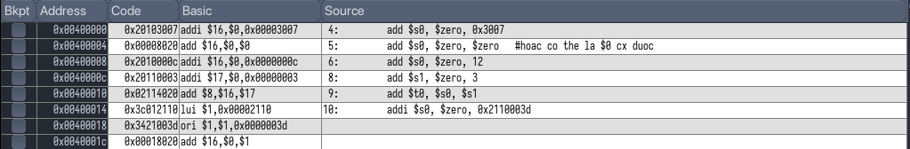
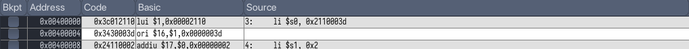
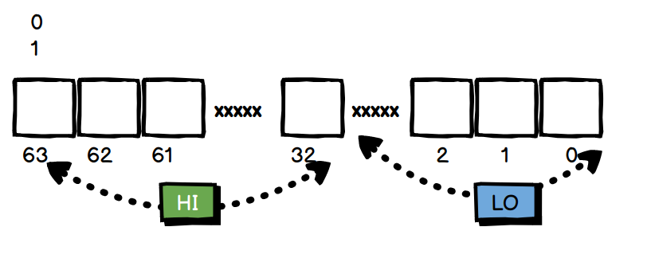

# Lab 5

## Service number `syscall`

> A number of system services, mainly for input and output, are available for use by your MIPS program

### How to use SYSCALL system services

1. Load the service number in register `$v0`.  

2. Load argument values, if any, in `$a0`, `$a1`, `$a2` as specified.  

3. Issue the `SYSCALL` instruction.  

4. Retrieve return values, if any, from result registers as specified.

### Sample file I\\O

```c
.data
  fout:   .asciiz "testout.txt"      # filename for output
  buffer: .asciiz "The quick brown fox jumps over the lazy dog."
.text
  ###############################################################
  # Open (for writing) a file that does not exist
  li   $v0, 13       # system call for open file
  la   $a0, fout     # output file name
  li   $a1, 1        # Open for writing (flags are 0: read, 1: write)
  li   $a2, 0        # mode is ignored
  syscall            # open a file (file descriptor returned in $v0)
  move $s6, $v0      # save the file descriptor 
  ###############################################################
  # Write to file just opened
  li   $v0, 15       # system call for write to file
  move $a0, $s6      # file descriptor 
  la   $a1, buffer   # address of buffer from which to write
  li   $a2, 44       # hardcoded buffer length
  syscall            # write to file
  ###############################################################
  # Close the file 
  li   $v0, 16       # system call for close file
  move $a0, $s6      # file descriptor to close
  syscall            # close file
  ###############################################################
```

### `strcpy` from `C`

Copy 1 đoạn string từ `src` đến `dest`, như hàm `strcpy`đó. 

Thuật giải:

+ Vòng lặp chạy từ đầu đến đít `src`

+ Gặp ký tự `!=` giá trị `0` thì thực hiện copy giá trị đó tới `dest`

+ Ngược lại, gặp bằng `0` thì dừng

Sở dĩ là `0` bởi vì cuối string  là kí tự kết thúc xâu`\0` có giá trị `0`

Mõm thì đơn giản thế, nhưng vào trong `mips` nó lại khác :v

Nhưng vẫn dễ, làm phát ăn ngay :v.

Cơ bản, phải hiểu rõ việc load address (`la`), load giá trị từ adress (ở đây từng kí tự lưu trong 1 byte nên sử dụng `lb`), sau đó store lại byte giá trị đó bằng `sb`. Còn việc loop hay biến `i` thì đã làm nhiều rồi.

### Count length of string

> Get input string from user and count length of this string.

Bài này mới được áp dụng cái syscall ở trên :v. Bỏ qua thuật toán đếm độ dài đi, bài toán này cho mình áp dụng cách sử dụng input message string từ dialog và output int từ dialog.

Cái đầu tiên là input:

```
# get input str from user
GETINPUT:
	li $v0, 54
	la $a0, message1
	la $a1, str
	li $a2, 100
	syscall 
	slt $t9, $a1, $zero 
	bne $t9, $zero, GETINPUT
```

Tại sao lại có thêm 2 dòng cuối sau `syscall`, mình muốn user nhập chính xác string thì thôi. Thanh ghi `a1` chứa giá trị chỉ trạng thái của input, nói chung `< 0` thì là input không tốt, nên cho lặp lại.

Output cũng không có gì khó. Nhưng có một cái quan trọng là;

**NOTE**: string mình nhập vào có `\n`ở cuối (do cái `enter` bấm mà, lưu tất vào buffer), nên khi đếm xong thì giá trị phải `-1`. 

# Lab 4

## Overflow

Tràn số - khi lượng bit ta có không đủ để biểu diễn lượng dữ liệu ta mong muốn. Trong `mips`, overflow có thể xảy ra khi thực hiện các phép toàn với số 32 bit. Vậy làm sao để kiểm tra phép toán thực hiện có gây ra tràn số hay không?

+ 2 toàn tử phải cùng dấu (sign) hiển nhiên

+ Nếu cùng là số dương, nếu tổng nhỏ 1 toán hạng bất kì

+ Nếu cùng là số âm, nếu tổng lại lớn hơn 1 toán hạng bất kì.

Từ đó xây dựng nên solution cho bài toàn xác định overflow. 

1. Kiểm tra 2 toán hạng có cùng dấu hay không?
   
   2 bit cao nhất (bit 31) ghi dấu của toán hạng này (0 - dương và 1 - âm). Tức là ta chỉ cần quan tâm 2 bit đó. Ta thấy khi chúng đều là 0 và 1 thì cùng dấu (tức là `true` ) và ngược lại. Điều đó giúp liên tưởng đến toán tử logic `xor`. 

2. Kiểm tra 2 toán hạng âm hay dương
   
   Sau bước trên ta biết nó cùng dấu rồi, giờ chỉ việc kiểm tra bất kì 1 số thôi. Âm hay dương sẽ dẫn đến điều kiện để ra kết quả.

3. So sánh với tổng 2 số dựa theo điều kiện âm hay dương.

Tính tổng lúc này phải dùng `addu` để bỏ qua overflow, nếu dùng `add` thường, khi có overflow sẽ báo lỗi ngay.

1 mẹo code trong `mips` là mình nghĩ luôn code đáp án ra trước và ở cuối cùng, ngay sau là `END`. Luồng code từ trên xuống dưới nên sẽ luôn thực hiện điều này. Các trường hợp `if-else` nên sử dụng khéo léo đề jump xuống `END`, hoặc tiếp tục chạy để thực hiện đáp án mình muốn. 

## Extract infor from one register.

Các thanh ghi 32 bit, giờ muốn chỉ luốn lấy giá trị ví dụ 2 bit đầu, 2 bit cuối, hoặc bit thứ 10 của thanh ghi chẳng hạn, thì làm thế nào?

Thì dùng phép `and` thôi, cơ bản thì cũng dễ :v. Chỉ cần nhớ sử dụng `andi` hoặc `and`, nhưng trong trường hợp muốn lấy chính xác cụ thể như này thì nên dùng `andi` . 

Ví dụ:

```
li $s0, 0x0563                     
andi $t0, $s0, 0xff             
andi $t1, $s0, 0x0400             
```

+ `$s0` có giá trị ở dạng hexa là 0000 0563.

+ `andi` đầu tiên lấy 2 giá trị cuối cùng ở mã hexa của `$s0` , `ff` ở binary tức là `1111 1111`, `and` sẽ ra chính nó. 

+ Tương tự với phép `andi` thứ 2. để ý 2 bit cuối lúc này là `00`, tức là mình bỏ qua 2 số cuối của `$s0`. Sau đó đến số 4 (ở dạng nhị phân là `0100`), tức là mình lấy bit thứ 10 của `$s0` - hiện đang lưu trữ ở số 5 (`0101`), nên ta lấy được số `1`. 
  
  Ở dạng nhị phân `$t1` lúc này: `0000 0000 0000 0000 0000 0100 0000 0000` => Hexa `0x00000400`.

## Multiply but don't use `*`

Cái này thì trước đây mình từng dùng rồi. Toán tử logic dịch bit (trái hoặc phải), trong `C` là `>>` hoặc `<<`. 
Ứng dụng trong phép nhân, có thể sử dụng phép dịch trái `n` bit để nhân số hạng với $2^n$ 

# Lab 3

## `if-else`

> Basic if-then-else statement

Chắc mình cần notes 1 tẹo liên quan đến syntax

+ 1 block code: Khởi đầu bằng 1 từ gì đó, theo sau là `:`

    ```
    start:
        slt 	$t0, $s2, $s1	#j<i
        beq 	$t0, $zero, else            
        addi	$t1, $t1, 1
        addi 	$t3, $zero, 1
        j		endif
    else:
        ....
    ```
    Có 2 block code là `start` và `else`.

+ Tận lệnh dạng `jump` để nhảy đến các block code này, đó cũng là mấu chốt của `if-then-else`. Như bên trên thấy ở câu lệnh `beq` là J types, có thể nhảy đến block code là `else`.

+ 1 điều nữa là `mips` luôn thực hiện các câu lệnh từ trên xuống dưới, và đếch bỏ qua 1 câu lệnh nào cả (kể cả trong các block code riêng biệt), ta muốn bỏ qua thì phải dùng lệnh `j` để nhảy nhay qua cái khác.

Việc so sánh trong thứ ngôn ngữ máy hiểu (chứ người khó hiểu) này cần 2 bước:

1. Biểu thức `(i < j) ? check = true : false`: đầu tiên sử dụng `slt` hoặc tương đương, để tìm xem tham số `check` là `1` hay `0` (qui ước `1` lớn hơn và `0` nhỏ hơn). 

2. Từ tham số `check`, sử dụng `beq` hoặc `bne` để nhảy đến các block code tiếp theo xử lý. 

3. Một lưu ý là nếu ko cần nhảy thì cứ việc viết tiếp các lệnh ngay dưới, sau đó cuối cùng, sử dụng 1 lệnh `j` để nhảy đến 1 block code rỗng (ví dụ trên là `endif`), nếu không thì nó lại tiếp tục các câu lệnh tiếp theo ngay dưới nó, đúng không?

## `Loop` 

> Loop statement. 

Thật ra thì mình chưa hiểu lắm mảng ở đây là sao, làm sao để tạo mảng và lưu giá trị cho nó, phải biết vậy mới làm được bài toán tính tổng các giá trị trong mảng chứ?

Nhưng về `loop` thì cơ bản như sau:

```
i = 0 
loop:  
    if (i >= n) goto endloop 
    # code here
    i = i + step
    goto loop 
endloop: 
```

## Exercise 3

> Switch-case statement

Dễ hiểu mà :v

```
.text:
    li $t0, 0 # case 0
	li $t1, 1 # case 1
	li $t2, 2 # case 2
	
	beq $s1, $t0, case_0
	beq $s1, $t1, case_1
	beq $s1, $t2, case_2
	j default
	
case_0: 
	addi $s2, $s2, 1
	j continue
case_1:
	sub $s2, $s2, $t1
	j continue
case_2:
	add $s3, $s3, $s3
	j continue
default:
continue:
```

## Exercise 4

```
Modify the Assignment 1, so that the condition tested is 
a. i <j 
b. i >= j 
c. i+j <= 0 
d. i+j > m+n 
```

## Exercise 5

```
Modify the Assignment 2, so that the condition tested at the end of the loop is: 
a. i < n 
b. i <= n 
c. sum >= 0 
d. A[i] == 0 
```

## Exercise 6

```
Using all of above instructions and statements, create a new project to implement this function: find the element with the largest absolute value in a list of integers. 
Assuming that this list is store in an integer array and we know the number of element in its
```

Một bài toán chắc 3 dòng với code các ngôn ngữ bậc trung và cao, nhưng đây là hợp ngữ, nên chắc sẽ là 3 chục dòng :v. 
Về thuật toán cũng đơn giản: chỉ là duyệt qua tất cả các phần tử trong mảng, so sánh với 1 biến `result`, nếu giá trị tuỵệt đối của phần tử trong mảng lớn hơn thì gán lại biến `result` bằng giá trị đó, nếu không thì thôi. 

Để giải quyết bài toán như vậy, cần thực hiện các bài toán nhỏ hơn là:

+ Tính giá trị tuyệt đối của phần tử. 
+ So sánh 2 giá trị, gắn giá trị `res` mới.
+ Áp dụng được lệnh `for` và `if-else` ở trên. 

# Lab 1

## Assignment 1

> Lệnh gán số 16 bit

2 lệnh add cơ bản trong `mips` là `add` (R type) và `addi` (I type). Tại sao lại khác biệt vậy? Dù cả 2 đều là phép cộng 2 số hạng và gán cho một số hạng khác, nhưng mà `add` sử dụng 2 toán tử chính là 2 register, còn `addi` chỉ sử dụng 1 kèm với 1 hằng số (theo đúng định nghĩa chưa).

Các câu lệnh biên dịch bình thường:


Ở câu lệnh cuối: `addi $s0, $zero, 0x2110003d` lại được chia ra thành **3 lệnh nhỏ** là:

+ `lui $1, 0x00002110` 
+ `ori $1, $1, 0x0000003d`
+ `add $16, $0, $1` 

Dễ thấy có thể giải thích tại sao lại phải chia thành 3 câu lệnh nhỏ này, vì `addi` như đề cập trên ở dạng `I`, phần operand trong kiến trúc `mips` chỉ cho phép 16 bit, nên số `0x2110003d` có thể vi phạm điều kiện này.

`mips` chia nhỏ thành 3 câu lệnh trên, có thể bây giờ chưa cần hiểu chính xác ý nghĩa của từng câu, nhưng có thể phân tích 1 chút:

+ `$1` ở đây là thanh ghi `$at`, tức là thanh ghi chứa giá trị temp, `mips` đã tận dụng thanh ghi temp này để tính toán.
+ Lệnh cuối `add $16, $0, $1` thì `$16` chính là `$s0`, `$0` là `$zero` và cộng với cái temp trên. Thông minh đấy nhể :v.

## Assignment 2

> Lệnh gán số 32 bit

### Sự thay đổi giá trị của thanh ghi `$s0`

+ câu lệnh đầu tiên (I type), ở dạng basic chính xác là 
  
  ```
  lui $s0, 0x00002110 
  ```
  
    Tức là `$s0` = `0x00002110` * $2^{16}$ và `= 0x21100000`

+ Phép `ori` (J type) tiếp chính là `OR` `$s0` bây giờ với giá trị `0x0000003d`, từ đó `$s0` thành gía trị cần tìm (32 bit). 

## Assignment 3

> Lệnh gán, giả lệnh (pseudo)

Các giả lệnh là các lệnh không có trong các câu lệnh `mips` chuẩn, mà thực tế nó alias cho 1 hay nhiều lệnh khác. 

`li` (I type) gán gía trị trực tiếp (kiểu `int a = 4`) chứ không cần phải qua bước `a = 0 +4` như lệnh `add`. 

Hiên nhiên, việc xử lý operand sau chỉ ở 16 bit, nên nếu vượt quá, nó cũng sẽ chuyển thành 2 câu lệnh `lui` và `ori` như đã trình bày ở trên. 



`li` ở câu lệnh 2 alias cho `addiu`. Thế cái này khác gì cái `add`, hình như là về chuyện `unsigned`, nhưng sẽ tìm hiểu sau.

## Assignment 4

> Tính biểu thúc $2x + y = ?$

Gõ trên hợp ngữ mới hiểu nó rắc rối như nào :v, đầu tiên gán $x$,gán $y$ bằng ?, sau đó phải tính $2x$, rồi cuối cùng mới tìm được $2x+y$. 

## Assignment 5

> Phép nhân

Phép nhân thao tác trong `mips` được lưu trữ ở 2 thanh ghi `hi` và `lo`, tương tự với phép chia



Quan sát thấy thì 2 lệnh `mul` vừa là R vừa là I types, hề vl :v.  `mul` sẽ là giả lệnh, nó nhân 2 toán hạng đằng sau lại và gán cho thằng trước. Ở câu lệnh đầu thì là 2 thanh ghi rồi, nhưng câu lệnh sau là thanh ghi với 1 hằng số, vậy thì nó làm gì?

Câu lệnh cuối `mflo` đơn giản là lấy giá trị của thanh ghi `lo` và gắn cho thanh ghi biến. 

## Assingment 6

> tạo biến và truy cập biến

Phản ánh đúng quy trình CPU hoạt động nè. 

Gỉa sử cần 1 chương trình toán lớp 1 cần tính phép tính: $Z = 2X + Y$

Nó tạo 3 gía trị X, Y, X trong bộ nhớ đúng khum.

Đầu tiên, cpu muốn đọc dữ liệu để xử lý, nó hỏi thằng bộ nhớ của mình. Bộ nhớ trả lại địa chỉ của các biến đó, thông qua bus, đến các thanh ghi.

Các địa chỉ các các dữ liệu đó hiện tại được lưu trữ ở thanh ghi

```
la    $t8, X
la     $t9, Y
```

`la` chính là gắn địa chỉ của biến cần xử lý (X và Y) vào thanh ghi (`$t8` và `$t9`), nhận thấy địa chỉ của các biến này là 32 bit. Câu lệnh I type này sẽ lại chuyển thành lại lệnh `lui` và `ori` dể xử lý thôi (giống phép trước mình học rồi mà). 

Tiếp theo, cpu lấy giá trị của 2 chú bé trên thông qua địa chỉ có nó, trong bài này bằng lệnh:

```
lw    $t1, ($t8)
lw    $t2, ($t9)
```

`lw` sẽ load giá trị from memory đó. Đúng chu trình hoạt động chưa. Tiếp theo, CPU xử lý các dữ liệu này (đơn giản như làm mấy phép tính kểu phép cộng thông qua `ALU`) 

```
add $s0, $t1, $t1
add $s0, $s0, $t2
```

Thanh ghi `$s0` giờ lưu giá trị của phép toán, mình cần đưa nó vào biến Z theo yêu cầu của chương trình. 

```
la $t7, Z
sw $s0, 0($t7)
```

Một thanh ghi sẽ lưu tiếp địa chỉ của biến Z, sau đó `sw` sẽ store (không phải load như `lw` nữa) giá trị của `$s0` vào cái địa chỉ kia. Như vậy Z giờ đã có giá trị cần tìm. 
