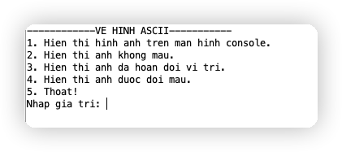
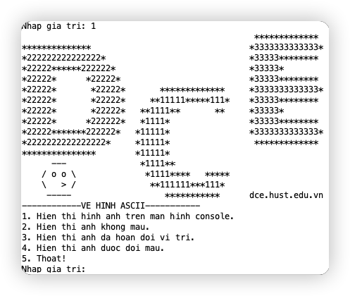
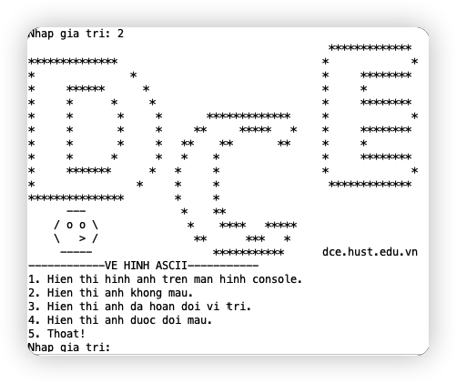
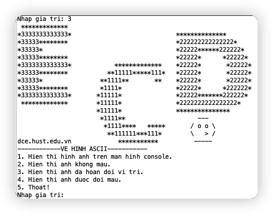
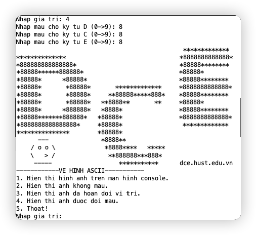
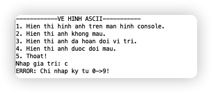

# Báo cáo project cuối kỳ

### Sinh viên

+ Mạc Văn Khánh - 2020
+ Dương Hữu Huynh - 20205087
  
### Đề bài

**Bài 9: Vẽ hình bằng kí tự ASCII**

Cho hình ảnh đã được chuyển thành các kí tự ascii như hình vẽ. Đây là hình của chữ DCE có viền `*` và màu là các con số.

```
                                               *************         
**************                                *3333333333333*        
*222222222222222*                             *33333********         
*22222******222222*                           *33333*                
*22222*      *22222*                          *33333********         
*22222*       *22222*       *************     *3333333333333*        
*22222*       *22222*     **11111*****111*    *33333********         
*22222*       *22222*   **1111**       **     *33333*                
*22222*      *222222*   *1111*                *33333********         
*22222*******222222*   *11111*                *3333333333333*        
*2222222222222222*     *11111*                 *************      
***************        *11111*                                      
      ---               *1111**                                      
    / o o \               *1111****   *****                          
    \   > /                **111111***111*                           
     -----                   ***********      dce.hust.edu.vn        
```
- Hãy hiển thị hình ảnh trên lên giao diện console (hoặc giao diện Display trong công cụ giả lập
Keyboard and Display MMIO Simulator)
- Hãy sửa ảnh để các chữ cái DCE chỉ còn lại viền, không còn màu số ở giữa, và hiển thị
- Hãy sửa ảnh để hoán đổi vị trí của các chữ, thành ECD, và hiển thị. Để đơn giản, các hoạt tiết
đính kèm cũng được phép di chuyển theo.
- Hãy nhập từ bàn phím kí tự màu cho chữ D, C, E, rồi hiển thị ảnh trên với màu mới.

*Chú ý: ngoài vùng nhớ lớn chứa ảnh được chứa sẵn trong code, không được tạo thêm vùng nhớ mới để chứa ảnh hiệu chỉnh.*

## Phân tích

1. Bài toán xoay quanh việc hiển thị hình ảnh lên màn hình console, vùng nhớ chứa ảnh được hard code sẵn trong source. Vậy vấn đề đầu tiên là tổ chức lưu trữ bức ảnh như thế nào để dễ dàng xử lý các thao tác tiếp theo của chương trình.
  
    + Ý tưởng lưu trữ từng ký tự (D, C, E) thành 1 chuỗi string. 
    + Ý tưởng lưu mỗi dòng của ảnh thành 1 chuỗi String.

    Với ý tưởng đầu tiên, việc xử lý các ký tự trong chuỗi (đổi ký tự màu, xoá ký tự thành khoảng trắng) sẽ đơn giản hơn so với xử lý chuỗi theo dòng - do cách một thì một chuỗi chỉ lưu 1 chữ cái, còn cách hai xuất hiện cả 3 ký tự màu của 3 chữ. Tuy nhiên, việc in cả ảnh 3 chữ sẽ phức tạp hơn nhiều.

    Trong project sẽ chọn **cách 2** để triển khai. 

2. Trong ảnh có ký tự `'\'`, đây là ký tự escape để kết hợp với ký tự liền sau tạo thành ký tự khác. Do đó nếu chỉ để `\`, nó sẽ không in ra. Ta cần escape chính ký tự escape :), vậy nên cần sử dụng `'\\'`.  

2. Có 4 yêu cầu rõ ràng từ đề bài, có thể triển khai luôn 4 function từ các yêu cầu đó, nhưng trong các yêu cầu này có các function nhỏ hơn thực hiện cùng 1 chức năng, ví dụ:

    + In bức ảnh với màu khác. Có thể là ký tự trắng (func2) hoặc ký tự do người dùng xác định (func4).
    + Các ký tự mới này chỉ thay đổi ở vùng màu, tức là vùng các ký tự chữ số. Vậy để thay đổi, chỉ cần kiếm tra ký tự đang xét có phải là ký tự chữ số không, nếu đúng thì đổi sang màu mới.

    Có thể lập thêm các chương trình con từ đây.
3. Để lấy lựa chọn của người dùng, sử dụng 1 menu để ghi các chức năng và mã code, từ 1-5 (4 lệnh theo đề bài và 1 lệnh thoát).
4. Do chương trình chỉ cần người dùng nhập các chữ số từ 0 đến 9 để thực hiện thao tác (chọn chức năng hay nhập màu mới) nên khi người dùng nhập sai, ví dụ như nhập ký tự `a`, hoặc số nhập lớn hơn 9, sẽ có interrupt để cảnh báo.
5. 4 yêu cầu chính của bài sẽ được phân tích kỹ hơn ở phần **thuật toán**.
   
## Thuật toán

### Hiển thị hình ảnh trên màn hình console

Do sử dụng cách lưu trữ ảnh theo dòng đã đề cập ở trên, việc in toàn bộ hình ảnh xoay quanh việc in từng dòng một đã được hard code sẵn. 

Như vậy, cần xác định được số lượng dòng và số lượng ký tự mỗi dòng.

```c
for_loop_original_image:
    beq $t0, $s0, main					# if i = number of lines in image, end process, go to main
    li  $v0, 4							# call syscall 4 to print string in address $a0
    syscall
        
    addi $a0, $a0, LINE_SIZE			# $a0 += LINE_SIZE + 1
	addi $a0, $a0, 1					# we change $a0 to point to next line
    addi $t0, $t0, 1					# ++i
    j for_loop_original_image
```
```c
    li $a1, 0								
	li $a2, LETTER_SIZE					
	add $a3, $s1, $zero						# $a3 = $s1 ~ new color in letter D
											# change digit character in line from index 0 to 23 (mean index of letter D) to new color	
	jal change_digit_character_in_line
```
Với `$a0` lưu địa chỉ của dòng đầu tiên, `$s0` lưu số dòng của ảnh.

### Các chữ cái DCE chỉ còn lại viền, không còn màu số ở giữa, và hiển thị

Từ phân tích, ta triển khai thêm 2 chương trình con hỗ trợ:

+ Kiếm tra ký tự có phải là ký tự chữ số: `is_digit`
  + Tham số: 1 ký tự cần kiếm tra
  + Đầu ra : 1 nếu là ký tự chữ số, 0 trong trường hợp còn lại
  + Do đầu vào là ký tự, cần so sánh với ký tự '0' và '9' trong ASCII code tương ứng với 48 và 57.
+ Thay đổi ký tự số trong chuỗi thành màu khác: `change_digit_charactor_in_line`
  + Tham số:
    + Địa chỉ chuỗi
    + Vị trí bắt đầu
    + Vị trí kết thúc
    + Ký tự mới
  + Đồng thời in ra chuỗi mới đó, cũng từ vị trí đầu đến kết trong phần tham số.
  + Chương trình này sử dụng `is_digit` hỗ trợ việc kiểm tra ký tự nào cần thay mới.

Vậy, ở chương trình chính, sử dụng 1 vòng `for` để duyệt qua tất cả các dòng, ở mỗi dòng, gọi chương trình con `change_digit_charactor_in_line` với các tham số: địa chỉ của chuỗi là địa chuỗi đang xét hiện tại, bắt đầu từ 0, kết thúc là độ dài chuỗi, ký tự mới là ký tự khoảng trắng ' '. 

```c
    li $a0, LINE_1
    li $a1, 0							# assign argument to $a0, $a1, $a2, $a3 to call function
	li $a2, LINE_SIZE
	li $a3, ASCII_SPACE
	
	jal change_digit_character_in_line  # call function
```
### Hoán đổi vị trí của các chữ, thành ECD, và hiển thị.

Theo đề bài, ta cần in ra chữ theo thứ tự `E -> C -> D`. Trong 1 dòng, do kích thước của từng chữ là giống nhau (23), nên phần chữ `D` luôn từ index `0` đến `22` . Chữ `E` từ index `23` đến `45` (size letter). Chữ `C` từ index `46` đến `68`. 

Trong `mips`, hàm `syscall 4` để in chuỗi kết thúc bằng ký tự `null`. Do đó, ta chỉ cần set ký tự này cho vị trí cuối của các từng ký tự trong 1 dòng (ở các vị trí 22, 45, 68). Sau đó in từ lần lượt từ vị trí 46, 22, 0 để ra được kết quả in chữ E trước, rồi đến C và D.

```c
    # assign "\0" to end of each leter in a line
    sb  $zero, 22($s1)     				# line_i[22] = '\0'
    sb  $zero, 45($s1)     				# line_i[45] = '\0'
    sb  $zero, 68($s1)     				# line_i[68] = '\0'
```
```c
    li $v0 4
    la $a0 46($s1)     					# print E
    syscall
        
        
    li $v0 4
    la $a0 23($s1)     					# print C
    syscall
        
    li $v0 4
    la $a0 0($s1)      					# print D
    syscall
```
### Nhập từ bàn phím kí tự màu cho chữ D, C, E, rồi hiển thị ảnh trên với màu mới.

Giống với yêu cầu thứ 2 nhưng thay vì ký tự khoảng trắng, ký tự mới được xác định từ người dùng. Tuy nhiên, do từng chữ có màu khác nhau. Ở mỗi vòng lặp từng dòng, ta lần lượt gọi chương trình con `change_digit_charactor_in_line` như sau:
+ `change_digit_charactor_in_line(line_i, 0, 22, new_charactor_D)` Để in ra chuỗi mới cho ký tự D.
+ `change_digit_charactor_in_line(line_i, 23, 46, new_charactor_C)` Để in ra chuỗi mới cho ký tự C.
+ `change_digit_charactor_in_line(line_i, 47, 70, new_charactor_E)` Để in ra chuỗi mới cho ký tự E.

Ví dụ lấy giá trị mới cho D.
```c 
# get user input
get_new_d:	
		li 	$v0, 4		
		la 	$a0, D_COLOR_PROMPT
		syscall
	
		li 	$v0, 5							# get number input to $v0
		syscall

		addi $a0, $v0, 48   				# make $a0 from number to ascii code
		jal is_digit						# check if $a0 is a digit by call function is_digit
		
		beq $v0, $zero, get_new_d 			# if $v0 is not a digit, go back
		
		add $s1, $a0, $zero					# $s1 = $a0. $s1 contain ascii code of new color in letter D
```

Ví dụ với ký tự D
```c
    li $a0, LINE_1
    li $a1, 0								
	li $a2, LETTER_SIZE					
	add $a3, $s1, $zero						# $a3 = $s1 ~ new color in letter D
											# change digit character in line from index 0 to 23 (mean index of letter D) to new color	
	jal change_digit_character_in_line
```


### Interrupt

Để lấy input từ người dùng, ta dùng `syscall 5` để lấy giá trị số nguyên. Do đó nếu người dùng nhập các ký tự không hợp lệ như `a`, chương trình sẽ báo lỗi.

Xử lý `interrupt` để chương trình thông báo 1 đoạn báo nguyên nhân lỗi.

```c
#~~~~~~~~~~~~~~~~~~~~~~~~~~~~~~ ~~~~~~~~~~~~~~~~~~~~~~~~~~~~~~~~~~~
# GENERAL INTERRUPT SERVED ROUTINE for all interrupts
#~~~~~~~~~~~~~~~~~~~~~~~~~~~~~~~~~~~~~~~~~~~~~~~~~~~~~~~~~~~~~~~~~
.ktext 0x80000180

	# process
	addi $v0, $zero, 4
	la $a0, CHAR_ERROR_PROMPT		# show error message
	syscall
	
	li $v0, 10					# exit program
	syscall
	
	# pc <- pc + 4
	mfc0 $at, $14
	addi $at, $at, 4
	mtc0 $at, $14
	
	eret
```

## Mã nguồn


Xem đầy đủ [tại](https://github.com/betty2310/Mips-architure/blob/master/Mips-Project/final/n09_g01_DuongHuuHuynh_MacVanKhanh.asm). 
1. Chương trình con `is_digit`
   
   ```c
   #=======================================================================================
    # FUNCTION		is_digit to check character is digit from 0 to 9
    # @param[in] 	$a0: character
    # @return  	 	$v0: 1 if true and 0 if false
    #=======================================================================================
    is_digit:
        # backup 
        addi $sp, $sp, -4
        sw $t0, 0($sp)
        addi $sp, $sp, -4
        sw $t1, 0($sp)
        addi $sp, $sp, -4
        sw $t2, 0($sp)
	
	# process
        li $t1, ASCII_0				#t1 = 0
        li $t2, ASCII_9				#t2  = 9
        
        blt $a0, $t1, false			# if $a0 < 0, return false	
        blt $t2, $a0, false			# if $a0 > 9, return false

    true:
        addi $v0, $zero, 1
        j restore
    false:
        li $v0, 0
        j restore
	
	# restore
    restore:
        lw $t2, 0($sp)
        addi $sp, $sp, 4
        lw $t1, 0($sp)
        addi $sp, $sp, 4
        lw $t0, 0($sp)
        addi $sp, $sp, 4
    return:
	    jr $ra 
   ```


2. Chương trình con `change_digit_characer_in_line`
    ```c
    #=======================================================================================
    # FUNCTION		change digit character to new character in line from start index to end, and print each character 
    #				to console.
    # @param[in] 	$a0: address of line
    # @param[in] 	$a1: postion start
    # @param[in] 	$a2: postiton end
    # @param[in] 	$a3: new character
    # @return  	 	void
    #=======================================================================================
    change_digit_character_in_line:
        # backup
        addi $sp, $sp, -4
        sw $t0, 0($sp)
        addi $sp, $sp, -4
        sw $s0, 0($sp)
        
        add $k0, $a0, $zero    						#backup $a0
        add $k1, $ra, $zero							#backup $ra

	# process:
        for_loop_to_change_digit:
        beq $a1, $a2, end_loop						# if $a1 = $a2 ~ start = end, end process
        add $t0, $a0, $a1							# $t0 = &line[start]
        lb $s0, 0($t0)								# $s0 = line[start]
        addi $a1, $a1, 1							# ++start
        
        add $a0, $s0, $zero							# asign arugment to function is_digit: check $s0 

        jal is_digit
        
        beq $v0, $zero, print_char					# fasle, print $s0 to console

        li $v0, 11									# true, print new character ($a3) to console	
        add $a0, $a3, $zero
        syscall

        add $a0, $k0, $zero							# restore $a0 because we change it in function is_digit
        j for_loop_to_change_digit
	
    print_char:
        li $v0, 11
        syscall

        add $a0, $k0, $zero							# backup $a0
        j for_loop_to_change_digit
	
	
    end_loop:
	
        #restore
        lw $s0, 0($sp)				
        addi $sp, $sp, 4
        lw $t0, 0($sp)
        addi $sp, $sp, 4
        add $ra, $k1, $zero
        jr $ra
    ```

## Kết quả

Màn hình menu.



Thực hiện chức năng 1.



Thực hiện chức năng 2.



Thực hiện chức năng 3.




Thực hiện chức năng 4.



Báo lỗi và thoát khi người dùng nhập sai.


