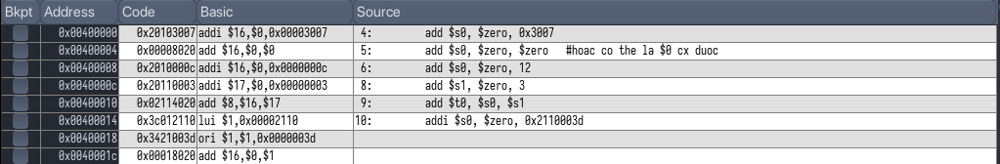
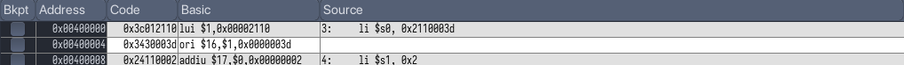
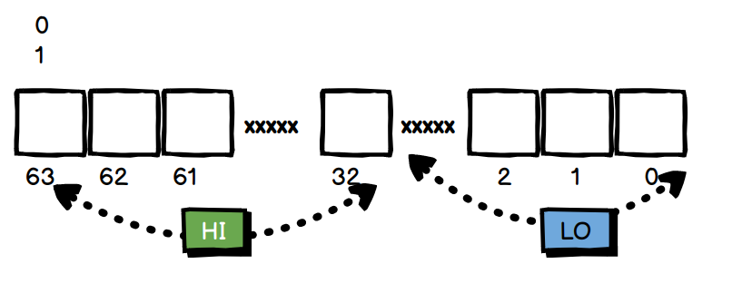

# Assignment 1

> Lệnh gán số 16 bit

2 lệnh add cơ bản trong `mips` là `add` (R type) và `addi` (I type). Tại sao lại khác biệt vậy? Dù cả 2 đều là phép cộng 2 số hạng và gán cho một số hạng khác, nhưng mà `add` sử dụng 2 toán tử chính là 2 register, còn `addi` chỉ sử dụng 1 kèm với 1 hằng số (theo đúng định nghĩa chưa).

Các câu lệnh biên dịch bình thường:


Ở câu lệnh cuối: `addi $s0, $zero, 0x2110003d` lại được chia ra thành 3 lệnh nhỏ là:

+ `lui $1, 0x00002110` 
+ `ori $1, $1, 0x0000003d`
+ `add $16, $0, $1` 

Dễ thấy có thể giải thích tại sao lại phải chia thành 3 câu lệnh nhỏ này, vì `addi` như đề cập trên ở dạng `I`, phần operand trong kiến trúc `mips` chỉ cho phép 16 bit, nên số `0x2110003d` có thể vi phạm điều kiện này.

`mips` chia nhỏ thành 3 câu lệnh trên, có thể bây giờ chưa cần hiểu chính xác ý nghĩa của từng câu, nhưng có thể phân tích 1 chút:

+ `$1` ở đây là thanh ghi `$at`, tức là thanh ghi chứa giá trị temp, `mips` đã tận dụng thanh ghi temp này để tính toán.
+ Lệnh cuối `add $16, $0, $1` thì `$16` chính là `$s0`, `$0` là `$zero` và cộng với cái temp trên. Thông minh đấy nhể :v.

# Assignment 2

> Lệnh gán số 32 bit

### Sự thay đổi giá trị của thanh ghi `$s0`

+ câu lệnh đầu tiên (I type), ở dạng basic chính xác là 

    ```
    lui $s0, 0x00002110 
    ```

    Tức là `$s0` = `0x00002110` * $2^{16}$ và `= 0x21100000`

+ Phép `ori` (J type) tiếp chính là `OR` `$s0` bây giờ với giá trị `0x0000003d`, từ đó `$s0` thành gía trị cần tìm (32 bit). 

# Assignment 3

> Lệnh gán, giả lệnh (pseudo)

Các giả lệnh là các lệnh không có trong các câu lệnh `mips` chuẩn, mà thực tế nó alias cho 1 hay nhiều lệnh khác. 

`li` (I type) gán gía trị trực tiếp (kiểu `int a = 4`) chứ không cần phải qua bước `a = 0 +4` như lệnh `add`. 

Hiên nhiên, việc xử lý operand sau chỉ ở 16 bit, nên nếu vượt quá, nó cũng sẽ chuyển thành 2 câu lệnh `lui` và `ori` như đã trình bày ở trên. 



`li` ở câu lệnh 2 alias cho `addiu`. Thế cái này khác gì cái `add`, hình như là về chuyện `unsigned`, nhưng sẽ tìm hiểu sau.

# Assignment 4

> Tính biểu thúc $2x + y = ?$

Gõ trên hợp ngữ mới hiểu nó rắc rối như nào :v, đầu tiên gán $x$,gán $y$ bằng ?, sau đó phải tính $2x$, rồi cuối cùng mới tìm được $2x+y$. 

# Assignment 5

> Phép nhân

Phép nhân thao tác trong `mips` được lưu trữ ở 2 thanh ghi `hi` và `lo`, tương tự với phép chia



Quan sát thấy thì 2 lệnh `mul` vừa là R vừa là I types, hề vl :v.  `mul` sẽ là giả lệnh, nó nhân 2 toán hạng đằng sau lại và gán cho thằng trước. Ở câu lệnh đầu thì là 2 thanh ghi rồi, nhưng câu lệnh sau là thanh ghi với 1 hằng số, vậy thì nó làm gì?

Câu lệnh cuối `mflo` đơn giản là lấy giá trị của thanh ghi `lo` và gắn cho thanh ghi biến. 

# Assingment 6

> tạo biến và truy cập biến

Phản ánh đúng quy trình CPU hoạt động nè. 

Gỉa sử cần 1 chương trình toán lớp 1 cần tính phép tính: $Z = 2X + Y$

Nó tạo 3 gía trị X, Y, X trong bộ nhớ đúng khum.

Đầu tiên, cpu muốn đọc dữ liệu để xử lý, nó hỏi thằng bộ nhớ của mình. Bộ nhớ trả lại địa chỉ của các biến đó, thông qua bus, đến các thanh ghi.

Các địa chỉ các các dữ liệu đó hiện tại được lưu trữ ở thanh ghi

```
la	$t8, X
la 	$t9, Y
```

`la` chính là gắn địa chỉ của biến cần xử lý (X và Y) vào thanh ghi (`$t8` và `$t9`), nhận thấy địa chỉ của các biến này là 32 bit. Câu lệnh I type này sẽ lại chuyển thành lại lệnh `lui` và `ori` dể xử lý thôi (giống phép trước mình học rồi mà). 

Tiếp theo, cpu lấy giá trị của 2 chú bé trên thông qua địa chỉ có nó, trong bài này bằng lệnh:

```
lw	$t1, ($t8)
lw	$t2, ($t9)
```

`lw` sẽ load giá trị from memory đó. Đúng chu trình hoạt động chưa. Tiếp theo, CPU xử lý các dữ liệu này (đơn giản như làm mấy phép tính kểu phép cộng thông qua `ALU`) 

```
add $s0, $t1, $t1
add $s0, $s0, $t2
```

Thanh ghi `$s0` giờ lưu giá trị của phép toán, mình cần đưa nó vào biến Z theo yêu cầu của chương trình. 

```
la $t7, Z
sw $s0, 0($t7)
```

Một thanh ghi sẽ lưu tiếp địa chỉ của biến Z, sau đó `sw` sẽ store (không phải load như `lw` nữa) giá trị của `$s0` vào cái địa chỉ kia. Như vậy Z giờ đã có giá trị cần tìm. 